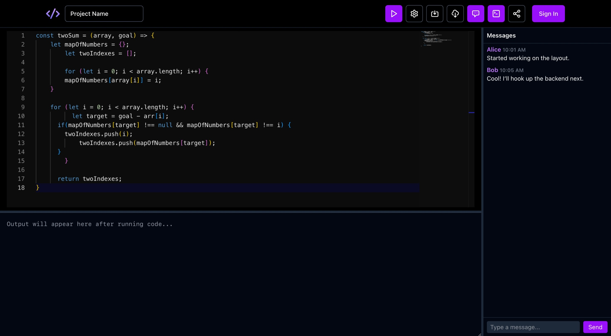
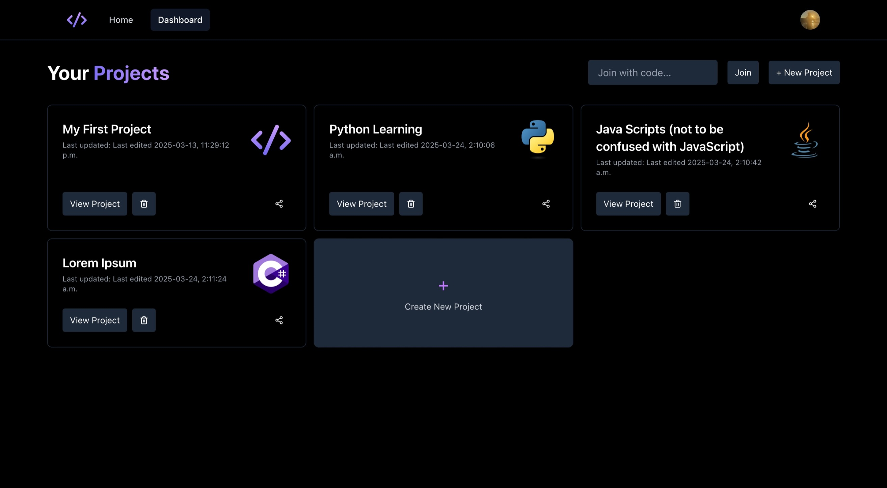

# VisuDocs

A collaborative, real-time code editor with support for multi-user editing. Similar to Google Docs, VisuDocs is a code editor that uses websockets to support multiple users working on the same code. Also supports features such as saving code, chat, and user authentication.

# Tech Stack

Frontend was built with React and TailwindCSS. Backend was built using Express, Node.js, and Socket.io for the multi-user functionality. MongoDB and Firestore were used to store code data. Redux and Firebase Auth were also used for user authentication, enabling sign-in with Google. 

Uses the [monaco editor](https://github.com/microsoft/monaco-editor) for the code editor and the Piston API to execute the code.

# UI Screenshots





# Usage

```git clone``` the repository and install the dependencies
```
git clone https://github.com/pnotato/VisuDocs
cd VisuDocs
npm i
```

You will need to create a ```.env``` file in the root directory with the following variables:
```
MONGODB_KEY=<a mongodb url>
JWT = <any string, will be used for json web token signing>
VITE_FIREBASE_KEY=<firebase api key>
```
Start the frontend by running ```npm run dev``` and backend with ```node server.js```. The app should start running on [http://localhost:5173/editor](http://localhost:5173/editor)


